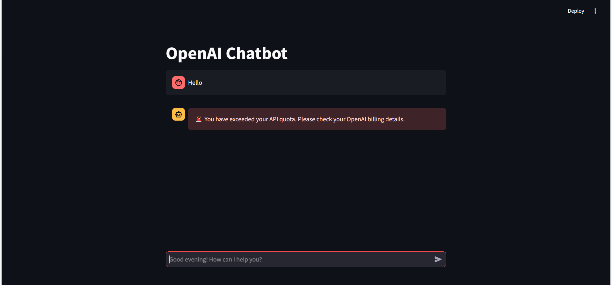

# OpenAI Chatbot with Streamlit

A simple chatbot powered by OpenAI's GPT-3.5/4 API, built using **Streamlit**.

## Features
- Interactive chat interface
- Handles API errors gracefully
- Supports message history
- Streamed responses for a smooth experience

## Error Handling Preview


## Installation
1. Clone the repository:
   ```sh
   git clone https://github.com/rahid31/chatbot-openai.git
   cd chatbot

2. Install dependencies:
    ```sh
    pip install -r requirements.txt
3. Set up .env file
    ```ini
    API_KEY=your_openai_api_key
4. Run the Chatbot:
    ```sh
    streamlit run app.py 